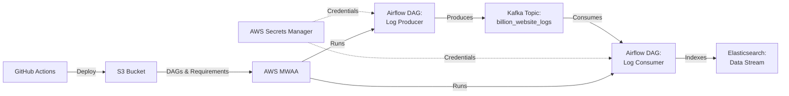

# 🚀 Real-Time Log Processing Pipeline with AWS MWAA

[](https://airflow.apache.org/)
[](https://kafka.apache.org/)
[](https://www.elastic.co/)
[](https://aws.amazon.com/managed-workflows-for-apache-airflow/)
[](https://www.python.org/)

> **A production-ready, scalable log processing pipeline that generates, streams, and indexes synthetic website logs using AWS Managed Workflows for Apache Airflow (MWAA), Kafka, and Elasticsearch.**

---

## 📋 Table of Contents

- [Overview](#-overview)
- [Architecture](#-architecture)
- [Features](#-features)
- [Tech Stack](#-tech-stack)
- [Prerequisites](#-prerequisites)
- [Installation](#-installation)
- [Configuration](#-configuration)
- [Deployment](#-deployment)
- [DAGs Overview](#-dags-overview)
- [Monitoring](#-monitoring)
- [Troubleshooting](#-troubleshooting)
- [Contributing](#-contributing)
- [License](#-license)

---

## 🎯 Overview

This project demonstrates a complete data engineering pipeline for processing high-volume website logs in real-time. It simulates a system capable of handling **1 billion+ website logs** by:

1. **Generating** realistic synthetic Apache-style logs using Faker
2. **Streaming** logs through Kafka with SASL/SSL authentication
3. **Processing** logs with Apache Airflow on AWS MWAA
4. **Indexing** structured logs into Elasticsearch for analysis and visualization

### Use Cases

- 📊 Real-time log analytics and monitoring
- 🔍 Security event tracking and anomaly detection
- 📈 Website traffic analysis and user behavior insights
- 🚨 Alert generation based on log patterns
- 📉 Performance monitoring and bottleneck identification

---

## 🏗️ Architecture


### Data Flow

1. **Log Generation**: Airflow Producer DAG generates synthetic Apache logs every 2 minutes (1,000 logs per run)
2. **Kafka Streaming**: Logs are published to Kafka topic with SASL_SSL security
3. **Log Consumption**: Airflow Consumer DAG polls Kafka and processes logs in batches
4. **Data Transformation**: Logs are parsed and structured with timestamps, IPs, methods, endpoints, etc.
5. **Elasticsearch Indexing**: Processed logs are bulk-indexed into Elasticsearch for querying

---

## ✨ Features

### 🎨 Core Capabilities
- ✅ **Production-Ready**: Built for AWS MWAA with Airflow 3.0.6
- ✅ **Secure by Design**: Uses AWS Secrets Manager for credential management
- ✅ **Scalable**: Handles high-throughput with Kafka streaming
- ✅ **Automated CI/CD**: GitHub Actions for seamless deployment
- ✅ **Real-time Processing**: Sub-minute latency from generation to indexing
- ✅ **Error Handling**: Comprehensive logging and retry mechanisms

### 🔧 Technical Features
- Confluent Kafka with SASL_SSL authentication
- Elasticsearch bulk indexing with data streams
- Airflow DAG scheduling (every 2 minutes)
- Synthetic data generation with realistic patterns
- Apache log format parsing with regex
- IAM-based AWS permissions

---

## 🛠️ Tech Stack

| Component | Technology | Version | Purpose |
|-----------|-----------|---------|---------|
| **Orchestration** | Apache Airflow (AWS MWAA) | 3.0.6 | Workflow management |
| **Streaming** | Confluent Kafka | 2.5+ | Message queue |
| **Search & Analytics** | Elasticsearch | 8.x | Log storage & indexing |
| **Language** | Python | 3.12 | DAG development |
| **Cloud Platform** | AWS | - | Infrastructure |
| **CI/CD** | GitHub Actions | - | Automated deployment |
| **Secrets Management** | AWS Secrets Manager | - | Credential storage |
| **Data Generation** | Faker | 20+ | Synthetic log creation |

---

## 📦 Prerequisites

### Required Services

- **AWS Account** with the following services:
  - AWS MWAA (Managed Workflows for Apache Airflow)
  - AWS S3 (for DAG storage)
  - AWS Secrets Manager (for credentials)
  - AWS IAM (for permissions)

- **Kafka Cluster**: Confluent Cloud or self-hosted Kafka with SASL_SSL
- **Elasticsearch Cluster**: Elastic Cloud or self-hosted (version 8.x)

### Required Permissions

Your AWS IAM user/role needs:
- `AmazonMWAAFullAccess` (or custom MWAA policies)
- `SecretsManagerReadWrite` (for secrets access)
- `AmazonS3FullAccess` (for DAG deployment)

### Local Development

- Python 3.12+
- AWS CLI configured with credentials
- Git

---

## 🚀 Installation

### 1. Clone the Repository
```bash
git clone https://github.com/yourusername/MWAAProject.git
cd MWAAProject
```

### 2. Set Up AWS Infrastructure

#### Create S3 Bucket for MWAA
```bash
aws s3 mb s3://kafka-mwaa-bucket --region us-east-1
```

#### Create AWS Secrets Manager Secret
```bash
aws secretsmanager create-secret \
    --name MWAA_Secrets_V2 \
    --secret-string '{
        "KAFKA_BOOTSTRAP_SERVER": "your-kafka-broker:9092",
        "KAFKA_SASL_USERNAME": "your-api-key",
        "KAFKA_SASL_PASSWORD": "your-api-secret",
        "ELASTICSEARCH_URL": "https://your-es-cluster:9200",
        "ELASTICSEARCH_API_KEY": "your-es-api-key"
    }' \
    --region us-east-1
```

#### Create MWAA Environment
```bash
aws mwaa create-environment \
    --name MWAA-Production \
    --source-bucket-arn arn:aws:s3:::kafka-mwaa-bucket \
    --dag-s3-path dags/ \
    --requirements-s3-path requirements.txt \
    --execution-role-arn arn:aws:iam::YOUR_ACCOUNT:role/mwaa-execution-role \
    --airflow-version 3.0.6 \
    --network-configuration SubnetIds=subnet-xxx,subnet-yyy,SecurityGroupIds=sg-xxx \
    --webserver-access-mode PUBLIC_ONLY \
    --region us-east-1
```

### 3. Install Python Dependencies (Local Development)
```bash
python -m venv airflow_venv
source airflow_venv/bin/activate  # On Windows: airflow_venv\Scripts\activate
pip install -r requirements.txt
```

---

## ⚙️ Configuration

### requirements.txt
```txt
confluent-kafka>=2.5.0
elasticsearch>=8.0.0
Faker>=20.0.0
```

### AWS Secrets Structure

Your `MWAA_Secrets_V2` secret should contain:
```json
{
  "KAFKA_BOOTSTRAP_SERVER": "pkc-xxxxx.us-east-1.aws.confluent.cloud:9092",
  "KAFKA_SASL_USERNAME": "YOUR_KAFKA_API_KEY",
  "KAFKA_SASL_PASSWORD": "YOUR_KAFKA_API_SECRET",
  "ELASTICSEARCH_URL": "https://your-cluster.es.us-east-1.aws.elastic.cloud:443",
  "ELASTICSEARCH_API_KEY": "YOUR_ES_API_KEY"
}
```

### GitHub Secrets (for CI/CD)

Add these secrets to your GitHub repository:

- `AWS_ACCESS_KEY_ID`: Your AWS access key
- `AWS_SECRET_ACCESS_KEY`: Your AWS secret key

---

## 🚢 Deployment

### Automated Deployment (GitHub Actions)

Push to `master` branch triggers automatic deployment:
```bash
git add .
git commit -m "Update DAGs"
git push origin master
```

GitHub Actions will:
1. Sync DAG files to `s3://kafka-mwaa-bucket/dags/`
2. Upload `requirements.txt` to S3
3. MWAA automatically picks up changes

### Manual Deployment
```bash
# Upload DAGs
aws s3 cp dags/logs_producer.py s3://kafka-mwaa-bucket/dags/logs_producer.py --region us-east-1
aws s3 cp dags/logs_processing_pipeline.py s3://kafka-mwaa-bucket/dags/logs_processing_pipeline.py --region us-east-1

# Upload requirements
aws s3 cp requirements.txt s3://kafka-mwaa-bucket/requirements.txt --region us-east-1

# Update MWAA environment (if requirements changed)
aws mwaa update-environment \
    --name MWAA-Production \
    --requirements-s3-path requirements.txt \
    --region us-east-1
```

---

## 📊 DAGs Overview

### 1. Log Generation Pipeline (`log_generation_pipeline`)

**Purpose**: Generates synthetic Apache-style website logs and publishes to Kafka

**Schedule**: Every 2 minutes (`*/2 * * * *`)

**Tasks**:
- `generate_and_produce_logs`: Generates 1,000 synthetic log entries and produces to Kafka topic

**Log Format**:
```
192.168.1.100 - - [Dec 07 2025, 14:30:15] "GET /api/users HTTP/1.1" 200 5432 "https://www.google.com" "Mozilla/5.0"
```

### 2. Log Consumer Pipeline (`log_consumer_pipeline`)

**Purpose**: Consumes logs from Kafka, parses them, and indexes to Elasticsearch

**Schedule**: Every 2 minutes (`*/2 * * * *`)

**Tasks**:
- `consume_and_index_logs`: Polls Kafka, processes logs in batches of 1,000, and bulk indexes to Elasticsearch

**Indexed Fields**:
```json
{
  "ip": "192.168.1.100",
  "timestamp": "Dec 07 2025, 14:30:15",
  "@timestamp": "2025-12-07T14:30:15",
  "method": "GET",
  "endpoint": "/api/users",
  "protocol": "HTTP/1.1",
  "status": 200,
  "size": 5432,
  "referrer": "https://www.google.com",
  "user_agent": "Mozilla/5.0"
}
```

---

## 📈 Monitoring

### Access Airflow UI

1. Go to [AWS MWAA Console](https://console.aws.amazon.com/mwaa)
2. Select `MWAA-Production`
3. Click **"Open Airflow UI"**

### View DAG Status
```bash
# Check DAG runs via CLI
aws mwaa create-web-login-token --name MWAA-Production --region us-east-1
```

### CloudWatch Logs
```bash
# View scheduler logs
aws logs tail /aws/mwaa/MWAA-Production/scheduler --follow --region us-east-1

# View task logs
aws logs tail /aws/mwaa/MWAA-Production/task --follow --region us-east-1
```

### Elasticsearch Queries
```bash
# Check indexed documents
curl -X GET "https://your-es-cluster:9200/billion_website_logs/_count" \
  -H "Authorization: ApiKey YOUR_API_KEY"

# Sample logs
curl -X GET "https://your-es-cluster:9200/billion_website_logs/_search?size=10" \
  -H "Authorization: ApiKey YOUR_API_KEY"
```

---

## 🐛 Troubleshooting

### Common Issues

#### ❌ DAG Import Errors: `ModuleNotFoundError: No module named 'confluent_kafka'`

**Solution**:
```bash
# Verify requirements.txt is in S3
aws s3 ls s3://kafka-mwaa-bucket/requirements.txt

# Check MWAA is using requirements
aws mwaa get-environment --name MWAA-Production --region us-east-1 --query "Environment.RequirementsS3Path"

# Trigger update if needed
aws mwaa update-environment \
    --name MWAA-Production \
    --requirements-s3-path requirements.txt \
    --region us-east-1
```

#### ❌ Kafka Authentication Errors

**Solution**: Verify secrets in AWS Secrets Manager:
```bash
aws secretsmanager get-secret-value --secret-id MWAA_Secrets_V2 --region us-east-1
```

#### ❌ MWAA Web UI Timeout

**Solution**: Check WebServerAccessMode:
```bash
# Should be PUBLIC_ONLY
aws mwaa get-environment --name MWAA-Production --region us-east-1 --query "Environment.WebServerAccessMode"

# Update if needed
aws mwaa update-environment \
    --name MWAA-Production \
    --webserver-access-mode PUBLIC_ONLY \
    --region us-east-1
```

#### ❌ DAG Not Appearing in UI

**Solution**:
1. Check S3 bucket structure: DAGs should be in `s3://kafka-mwaa-bucket/dags/`
2. Verify no Python syntax errors in DAG files
3. Check CloudWatch logs for import errors

---

## 📁 Project Structure
```
MWAAProject/
├── .github/
│   └── workflows/
│       └── s3-sync.yml          # CI/CD pipeline
├── dags/
│   ├── logs_producer.py         # Log generation DAG
│   └── logs_processing_pipeline.py  # Log consumer DAG
├── requirements.txt             # Python dependencies
├── README.md                    # This file
└── .gitignore                  # Git ignore rules
```

---

## 🎓 Key Learnings

This project demonstrates:

- ✅ **Airflow 3.0 Migration**: Adapted to breaking changes (`schedule` vs `schedule_interval`, no ORM access)
- ✅ **Streaming Architecture**: Kafka as decoupling layer between producer and consumer
- ✅ **Cloud-Native Design**: Leveraging AWS managed services for scalability
- ✅ **Security Best Practices**: Secrets management, IAM roles, SASL_SSL encryption
- ✅ **CI/CD Pipeline**: Automated deployments with GitHub Actions
- ✅ **Data Engineering Patterns**: Batch processing, bulk indexing, error handling

---

## 🤝 Contributing

Contributions are welcome! Please follow these steps:

1. Fork the repository
2. Create a feature branch (`git checkout -b feature/amazing-feature`)
3. Commit your changes (`git commit -m 'Add amazing feature'`)
4. Push to the branch (`git push origin feature/amazing-feature`)
5. Open a Pull Request

---

## 📄 License

This project is licensed under the MIT License - see the [LICENSE](LICENSE) file for details.

---

## 👤 Author

**Nifesimi Ademoyeoluwa**  
Data Engineer | 7 years experience in Data Analytics & Engineering

- GitHub: [@your-github](https://github.com/nifesimii)
- LinkedIn: [Your LinkedIn](https://linkedin.com/in/oluwanifesimi-ademoye) 
- Email: nifesimifrank.com

---

## 🙏 Acknowledgments

- Apache Airflow community for excellent documentation
- Confluent for Kafka Python client
- Elastic for Elasticsearch Python SDK
- AWS for managed Airflow service (MWAA)

---

## 📚 Additional Resources

- [Apache Airflow 3.0 Documentation](https://airflow.apache.org/docs/apache-airflow/stable/)
- [Confluent Kafka Python Client](https://docs.confluent.io/kafka-clients/python/current/overview.html)
- [Elasticsearch Python API](https://elasticsearch-py.readthedocs.io/)
- [AWS MWAA Documentation](https://docs.aws.amazon.com/mwaa/)

---

⭐ **If you found this project helpful, please consider giving it a star!** ⭐
